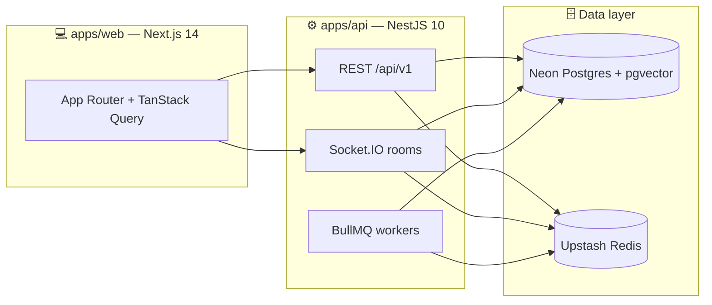

<div align="center">

# 🏆 ApteeZ

### _Practice. Compete. Conquer._

**The competitive aptitude ecosystem** — daily practice, live 1v1 duels, timed contests,
community events & a contributor-reviewed question library for placement and
government-exam aspirants.

<br/>

[](https://www.typescriptlang.org/)
[](https://nestjs.com/)
[](https://nextjs.org/)
[](https://neon.tech/)
[](https://upstash.com/)
[](https://www.prisma.io/)

<br/>

[](https://nodejs.org/)
[](https://pnpm.io/)
[](https://turbo.build/)
[](#-testing-philosophy)
[](LICENSE)

> 💡 _Aptitude prep is lonely and unmeasurable. ApteeZ makes it **competitive**
> and **measurable** — every attempt feeds ratings, streaks, weak-area analysis
> and an AI Performance Coach, so learners always know what to practice next._

</div>

---

## ✨ Feature Arena

<table>
<tr>
<td width="50%">

### 📝 Practice

Topic-organized library, server-graded submissions, favorites & revision signals. Contest solves count too.

### ⚔️ 1v1 Challenges

Redis matchmaking + Socket.IO live rooms, server-owned timers/scoring, Elo-style ratings.

### 🏁 Contests

Registration windows, frozen sets, fullscreen 🔒 lockdown, auto-submit, live standings with rating deltas, pace-bonus Elo, upsolve.

### 🎪 Events

Official vs Community · public / private 🔑 / university 🎓 · entry codes, invites, 170-university directory.

</td>
<td width="50%">

### 🤝 Contributions

Member questions → deterministic precheck → advisory AI review → **mandatory** human approval.

### 🎁 Rewards

Trigger-based points engine (admin rules, caps, cooldowns), achievements, streaks, redemption catalog.

### 📚 Learning

Paths, lessons, progress + resume, weak-area coaching.

### 💬 Community

Discussions, replies, reactions, reports, moderation queue.

</td>
</tr>
</table>

> 🤖 **AI is advisory only** — Performance Coach, RAG similar problems (pgvector),
> contribution review. Publishing, grading & moderation are deterministic code.
> See [`AI.md`](AI.md).

---

## 🏗 System Blueprint



```text
packages/
  🗃️ database/      Prisma 6 schema · migrations · seeds · generated client
  📦 types/          Shared DTOs — ONE contract, API ↔ web
  ✅ validation/     Zod schemas — request validation + form resolvers
  🎨 ui/ · 🔧 config/  Design system · nav · shared TS + ESLint presets
```

### 🧱 Non-negotiable engineering rules

| #   | Rule                                | Why it matters                                                                                                                                          |
| --- | ----------------------------------- | ------------------------------------------------------------------------------------------------------------------------------------------------------- |
| 🖥️  | **Server-authoritative everything** | Timers, scoring, correctness, ranks, ratings — the client is a display terminal. Even contest auto-submit fires only on the _server's_ clock.           |
| 🔌  | **Pooler-safe persistence**         | PgBouncer kills interactive transactions (`P2028`) → single statements, conditional writes, idempotency keys. Retries converge; nothing double-applies. |
| 👥  | **Two roles, nothing else**         | `user` creates only via contributions · `admin` holds all grants · ownership checks per object.                                                         |
| 🧠  | **AI advises, humans decide**       | AI output is surfaced as advisory; publishing & moderation stay deterministic.                                                                          |

---

## 🧰 Tech Arsenal

| Layer       | Stack                                                                 |
| ----------- | --------------------------------------------------------------------- |
| 🗣️ Language | TypeScript 5.6 (strict) · Node ≥ 20 · pnpm 9                          |
| ⚙️ Backend  | NestJS 10 · Prisma 6 · BullMQ · Socket.IO · Helmet · Throttler        |
| 💻 Frontend | Next 14 · React 18 · TanStack Query 5 · RHF + Zod · Recharts · Sonner |
| 🗄️ Data     | Neon Postgres + PgBouncer + pgvector · Upstash Redis                  |
| 🔐 Auth     | Opaque Redis sessions (HTTP-only 🍪) · Google OAuth · Resend OTP      |
| ✅ Quality  | Jest (API) · Vitest (web) · ESLint · Prettier · Turbo                 |
| 🚢 Deploy   | Per-app Dockerfiles · smoke + `deploy:verify` scripts                 |

---

## 🚀 Quickstart

> **Prereqs:** Node ≥ 20 · pnpm 9 · a Neon project · an Upstash Redis DB

```bash
# 1️⃣ Install
pnpm install

# 2️⃣ Configure — every variable is documented in .env.example
copy .env.example .env          # 🪟 Windows PowerShell  (or: cp .env.example .env)
# Fill in: DATABASE_URL (pooler, ?pgbouncer=true) · DIRECT_URL (direct)
#          UPSTASH_REDIS_URL · optional OAuth / Resend / AI keys

# 3️⃣ Database — migrate → generate → load structural data
pnpm db:deploy
pnpm db:generate
pnpm --filter @apteez/database exec dotenv -e ../../.env -- tsx prisma/bootstrap.ts

# 4️⃣ Run it — API :3001 · web :3000 🎉
pnpm dev
```

> ⚠️ `pnpm db:generate` rewrites the Prisma engine DLL — **stop the dev
> servers first** or Windows throws an `EPERM` rename at you.

### 📜 Everyday commands

| Command                                  | Does what                                  |
| ---------------------------------------- | ------------------------------------------ |
| `pnpm dev`                               | 🔥 Turbo: API watch + web dev              |
| `pnpm build`                             | 📦 Production builds (`dist/`, `.next/`)   |
| `pnpm typecheck`                         | 🔍 `tsc --noEmit` across the monorepo      |
| `pnpm test`                              | 🧪 Jest (API) + Vitest (web)               |
| `pnpm lint` / `pnpm format`              | 🧹 ESLint / Prettier write                 |
| `pnpm db:deploy`                         | 🗄️ Apply migrations (safe with servers up) |
| `pnpm db:seed`                           | 🌱 Dev content (never production!)         |
| `pnpm db:studio`                         | 👀 Prisma Studio                           |
| `pnpm smoke:prod` / `pnpm deploy:verify` | ✅ Post-deploy health checks               |

---

## 🗺 Monorepo Map

```text
apps/api/src/modules/
  🔐 auth · 👤 users · 📊 profile · 📝 problems · ✍️ submissions · 🏋️ practice
  ⚔️ challenge · 🏁 contest · 🎪 events · 🏛️ organizations
  🤝 contributions · 🛡️ admin/* · 🎁 rewards · 🏅 achievements
  📚 learning · 💬 discussions · ⭐ favorites · 🏆 leaderboard · 📈 ratings
  🔍 search · 🔔 notifications · 📉 analytics · 🤖 ai · 🗂️ storage · ⏳ queue
apps/web/src/
  🧭 app/          practice · challenges · contests · events · contribute
                   rewards · learn · discussions · leaderboard · profile
  🧩 components/   contest arena · lockdown · wizards · boards · charts
  🪝 hooks/        typed TanStack Query layer over the REST API
packages/database/prisma/
  📐 schema.prisma  → 40+ models, the whole domain in one file
  🧬 migrations/    → forward-only SQL, deploy-safe while servers run
  🌱 seed-data.ts   → taxonomy · RBAC · reward rules · 170 Indian universities
📖 docs/  ARCHITECTURE.md · DEPLOYMENT.md · SECURITY.md · AI.md · STARTUP.md
```

---

## 🔌 API at a Glance

Base path `/api/v1` · anonymous discovery where safe · mutations need the session 🍪 · admin routes need the matching grant.

<details>
<summary><b>🔐 Auth & Users</b></summary>

```text
POST /auth/register|login · POST /auth/email/verify-*
Google OAuth → opaque Redis session (HTTP-only cookie)
GET  /users/:username · /users/:username/overview   (privacy-gated 👁️)
GET  /profile/me/*  (performance · rating-history · heatmap · streak)
```

</details>

<details>
<summary><b>📝 Practice & Library</b></summary>

```text
GET  /problems · GET /problems/:id|/next
POST /submissions/attempts          (correctness computed server-side ✅)
```

</details>

<details>
<summary><b>⚔️ Challenges & 🏁 Contests</b></summary>

```text
POST /challenges/match · WS rooms · POST /challenges/:id/rating/retry
GET  /contests · POST /contests/:id/{register,start,answer,submit}
GET  /contests/:id/{session,leaderboard,result,upsolve}
POST /contests/:id/ratings/retry    (stuck-rating repair 🔧)
```

</details>

<details>
<summary><b>🎪 Events & 🤝 Contributions</b></summary>

```text
GET  /events · POST /events/:id/{register,join}   (code 🔑 · invite ✉️ · org 🎓)
POST /contributions
GET  /admin/contributions/:id  →  approve | reject | edit  (human-only ✅)
```

</details>

<details>
<summary><b>🎁 Rewards & 🏅 Achievements</b></summary>

```text
GET  /rewards/{points,catalog,rules} · POST /rewards/redeem
GET|POST|PATCH /admin/reward-rules · GET|PATCH /admin/achievements
```

</details>

---

## 🧪 Testing Philosophy

- 🧬 **Service specs (Jest, mocked Prisma)** — ledger idempotency, trigger
  fan-out, rating math, access gates, lifecycle transitions.
- 🖥️ **Component tests (Vitest + Testing Library)** — wizards, dialogs,
  navigation, empty/error/loading states.
- 🌍 **Journey + smoke scripts (`scripts/`)** — end-to-end assertions against
  staging/prod, with seed guard-rails (staging seeds refuse production DBs).

---

## 🚢 Deployment

- 🐳 `apps/api/Dockerfile` + `apps/web/Dockerfile` → registry → host.
- 🗄️ `pnpm db:deploy` on `DIRECT_URL` at release, then `pnpm smoke:prod`.
- 🔒 Secrets (`DATABASE_URL`, OAuth, Resend, AI keys) come from host env —
  **never committed** (only `.env.example` files are tracked).
- 📖 Details: [`DEPLOYMENT.md`](DEPLOYMENT.md) · [`SECURITY.md`](SECURITY.md) · `infrastructure/docker/`.

---

## 🤝 Contributing

1. 🌱 Branch from `main`, keep PRs focused.
2. ✅ `pnpm format && pnpm typecheck && pnpm test` — all green before review.
3. 🗄️ Migrations are hand-written SQL + `db:deploy`-verified; regenerate the
   client (`db:generate`, servers stopped) when `schema.prisma` changes.
4. 🖥️ Server owns correctness: never trust client-supplied amounts, answers,
   ranks or clocks.

---

## 📄 License

🔒 Private project — all rights reserved. Contact the repository owner for
licensing questions.

<div align="center">
<br/>

**Built with ❤️ for every aspirant grinding toward their dream.**

⭐ _Star it · 🍴 Fork it · 🚀 Ship it_

</div>
